# Hung-Up

[Live demo](https://hung-up-demo.delaneywells.dev)

**Stack:** React · Express (Node) · MongoDB · Cloudinary · Render

**What this project shows**

- End-to-end CRUD across a React frontend and custom REST API
- Thoughtful data modeling connecting Types, Clothing, and Outfits
- Image upload handling and media persistence
- Full deployment using a monorepo setup

---

_A full-stack wardrobe organizer built with React, Express, and MongoDB._

Hung-Up helps users catalog their clothes, outfits, and plan for occasions. This is a digital wardrobe built for the indecisive who dread getting dressed (like myself), _and_ for the fashion obsessed organizers-at-heart.

Originally adapted from a prior school project, this build-out is inspired by my real desire to think less about personal style.

Featured in my full-stack portfolio, this app demonstrates:

- Custom REST API (Node + Express + MongoDB)
- React front-end with modular SCSS styling
- Image uploads via Cloudinary
- CRUD operations with live demo data
- Deployment on Render using a monorepo setup

---

## Features

| Feature                 | Description                                                                           |
| ----------------------- | ------------------------------------------------------------------------------------- |
| **Clothing Management** | Add, edit, and rate your clothing items on different characteristics.                 |
| **Outfit Builder**      | Combine pieces into curated looks, log a photo of yourself in the look for reference. |
| **Drawers System**      | Access items easily through sorting by drawer.                                        |
| **Smart Metadata**      | Add details like color, size, and weather and occasion tags, pick your favorites.     |
| **Image Uploads**       | Upload outfit and clothing photos using Cloudinary integration.                       |
| **Demo Mode Notice**    | A visual banner and confirmational warning before any shared database changes.        |
| **Full Deployment**     | Hosted via Render with a Node backend and React frontend.                             |

---

## Demo environment:

This public demo uses a shared database. Any changes you make (adding, editing, or deleting items) will be visible to others. Please do not make changes unless you want to hire me. 😊

---

## Tech Stack

| Category            | Tools                        |
| ------------------- | ---------------------------- |
| **Frontend**        | React · SCSS Modules · Axios |
| **Backend**         | Express · Node.js · Mongoose |
| **Database**        | MongoDB Atlas                |
| **Image Storage**   | Cloudinary                   |
| **Deployment**      | Render (monorepo setup)      |
| **Version Control** | Git + GitHub                 |

---

## Project Structure

Here are far more details than you asked for:

```bash
hung-up/
├── api/                      # Express & MongoDB backend
│   └── src/
│       ├── controllers/      # business logic for API routes
│       ├── routes/           # Express route definitions
│       ├── models/           # Mongoose schemas and data models
│       ├── db/               # database connection helpers
│       └── server.js         # Express server entry point
│
└── client/                   # React frontend
    └── src/
        ├── components/       # reusable UI components
        ├── hooks/            # custom React hooks
        ├── pages/            # route-level views
        ├── styles/           # SCSS modules and theme files
        ├── utils/            # shared helper functions and formatting logic
        └── lib/              # client-side data layer or API service wrappers

```

---

## Screenshots

| View               | Screenshot                                             | Mobile                                              |
| ------------------ | ------------------------------------------------------ | --------------------------------------------------- |
| Home / Closet      | 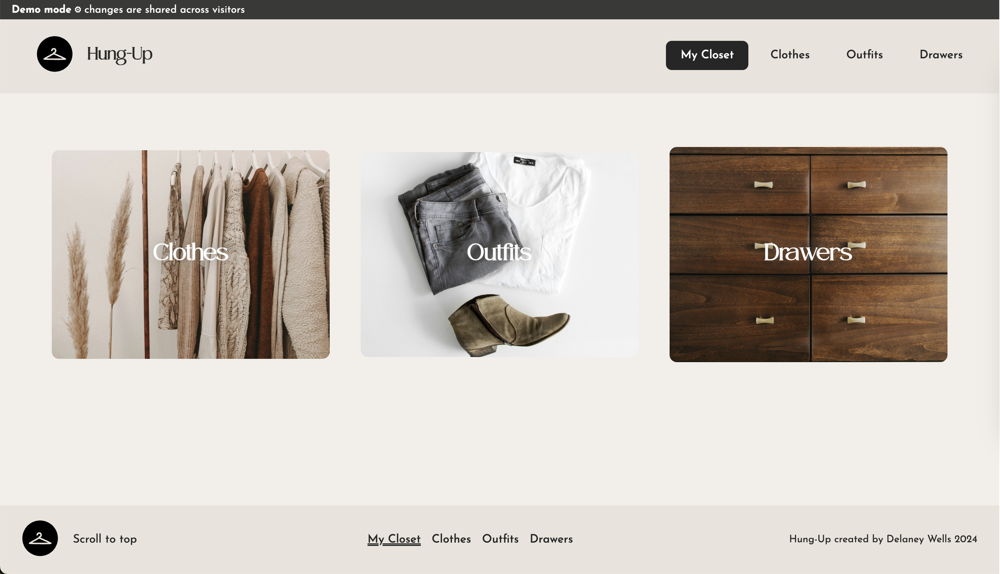        | 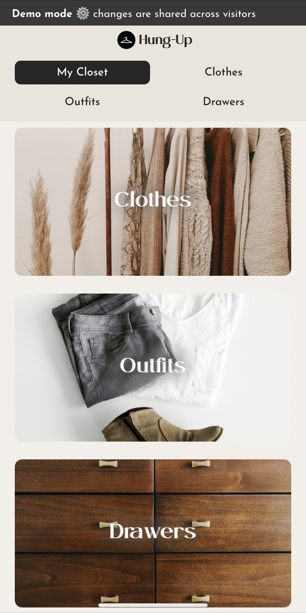         |
| Clothes Index      | 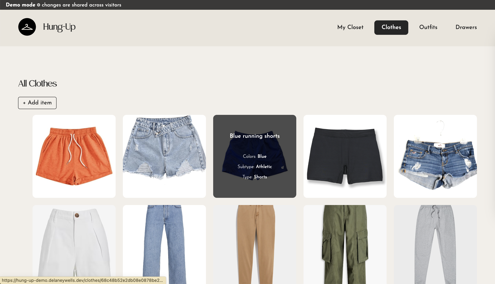      | 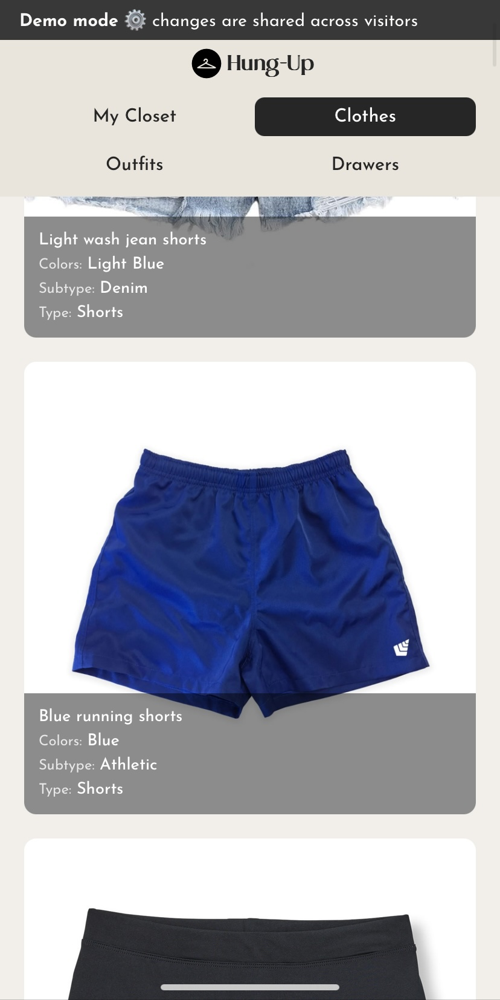      |
| Clothing Detail    | 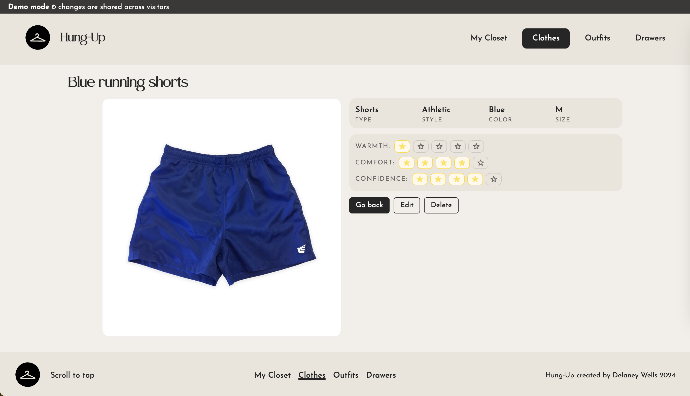    | 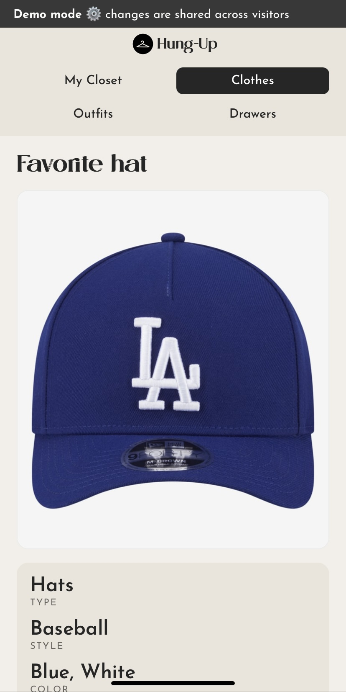    |
| Clothing Edit Form | 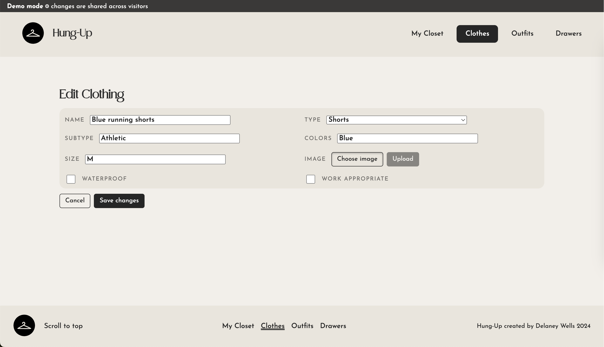 | 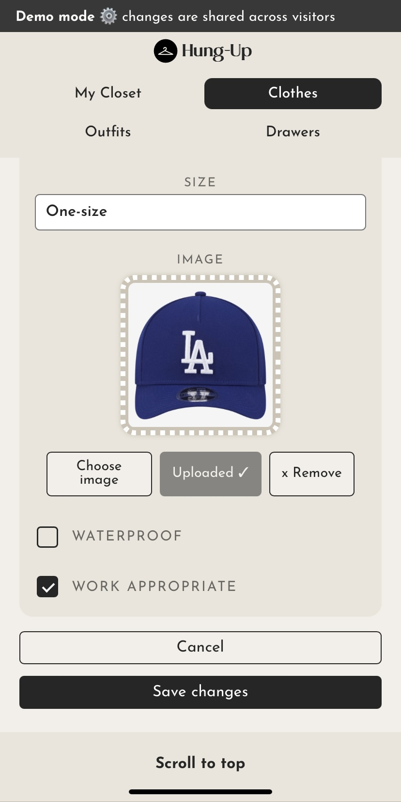 |
| Outfits Index      |       | 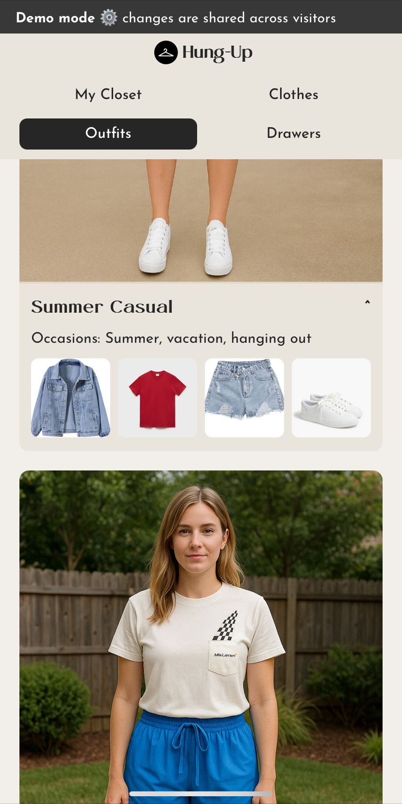      |
| Outfit Detail      | 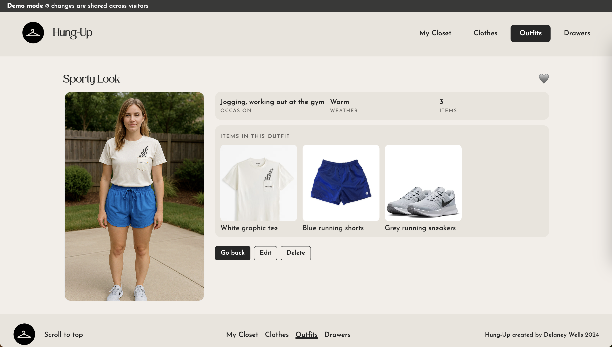      | 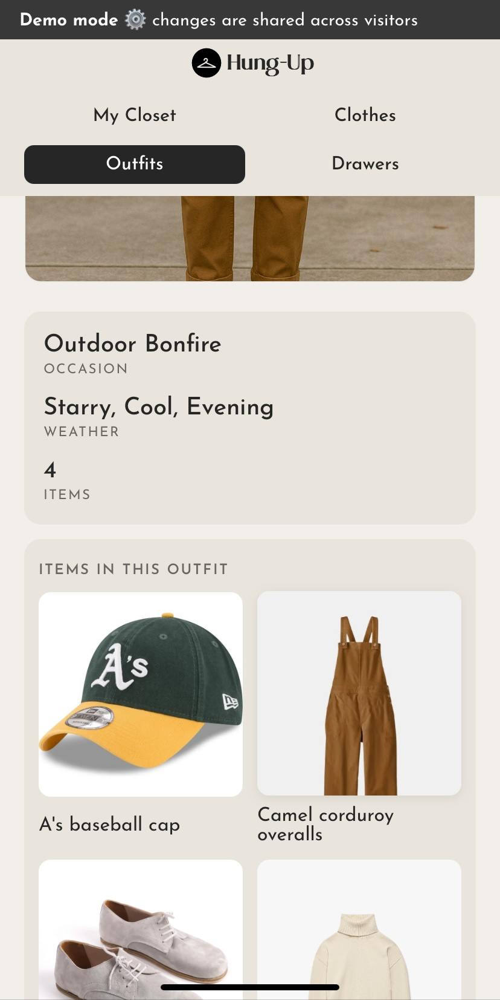      |
| Outfit Edit Form   | 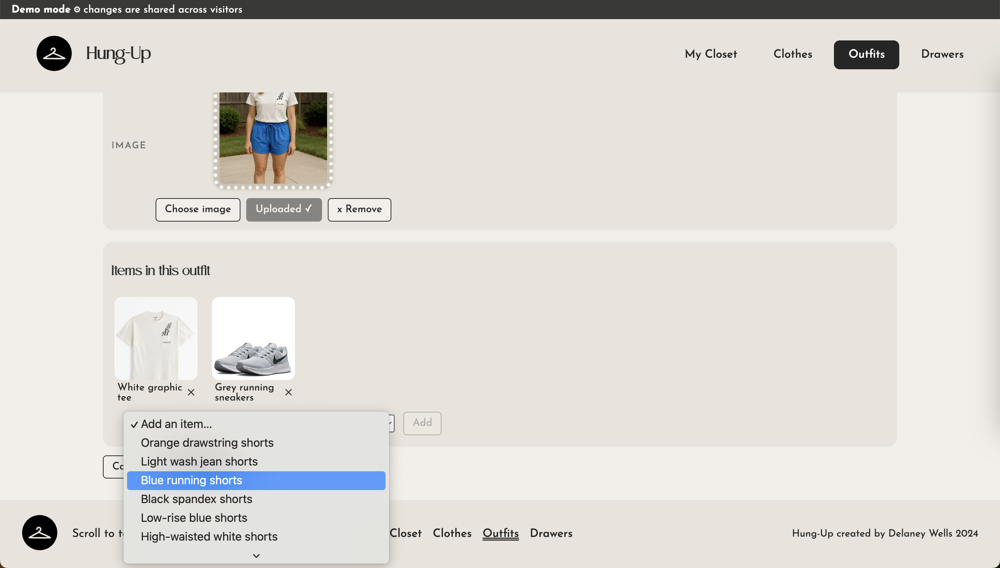   | 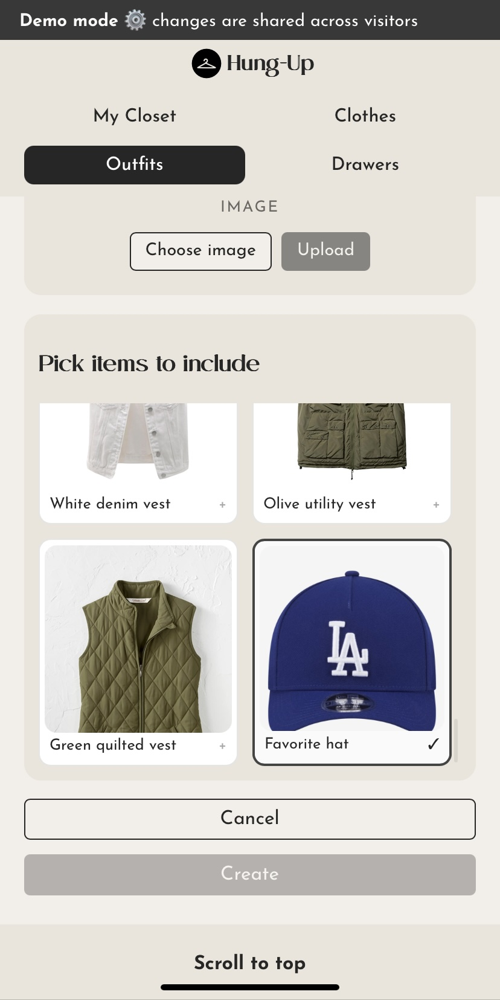   |
| Drawers Index      | 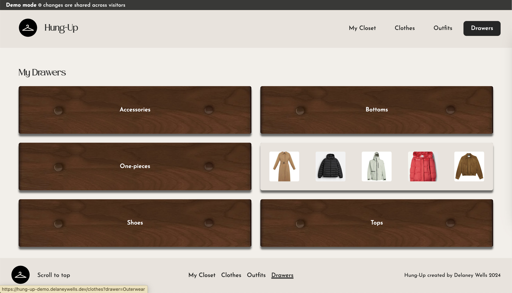      | 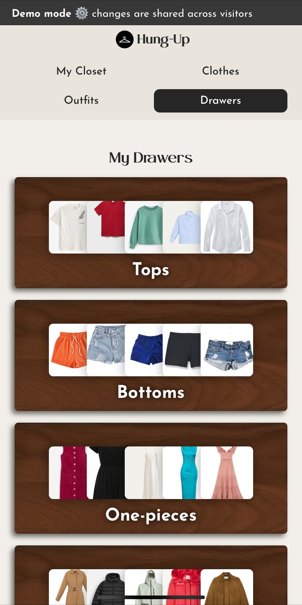      |
| Filtered Index     | 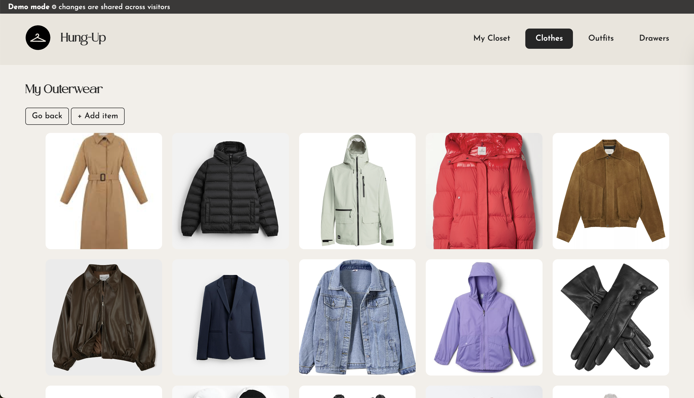     | 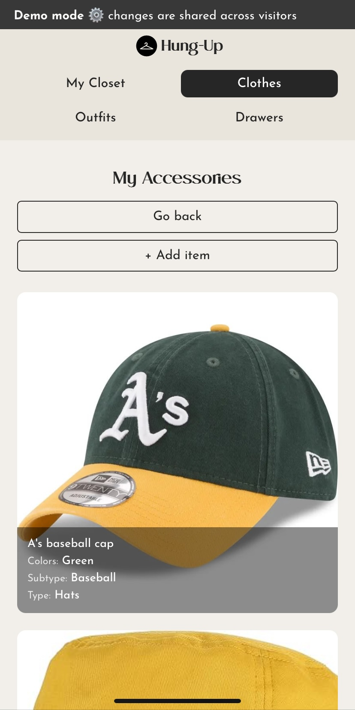     |

---

## ERD

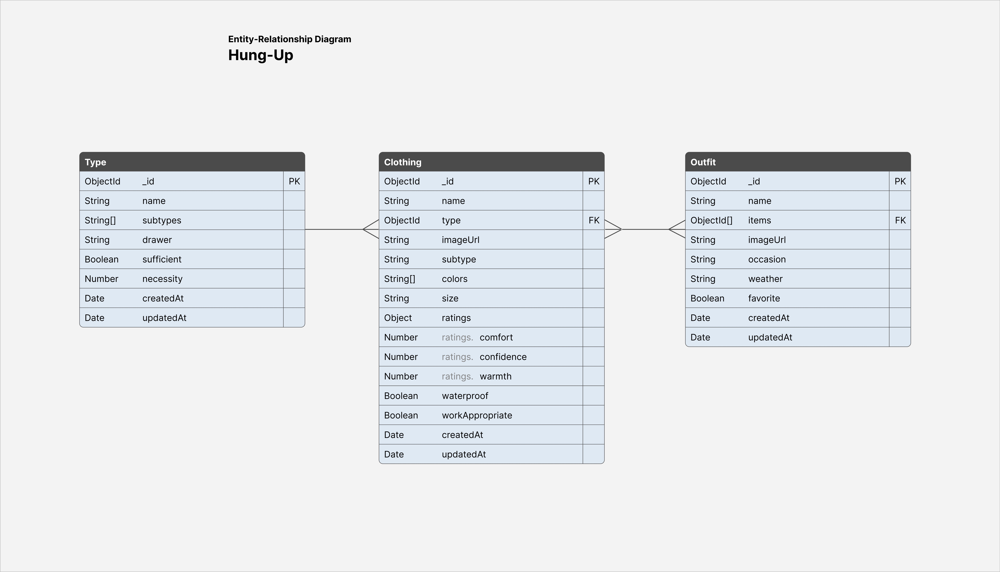

---

## Learning & Skill Development

Although the app uses three models (Clothing, Type and Outfit), the user does not interact with Type directly. Instead, I use the drawer property on Type to categorize the clothing documents. This approach makes the experience more intuitive and keeps the interface streamlined and uncluttered.

```JS
// selected from the DrawersPage component:

// get all drawers from the Type model
const drawers = Array.from(
  new Set(types.map(t => t.drawer).filter(Boolean))
).sort(/*by ORDER array built previously*/)

// attach each clothing item to its drawer
const clothesWithDrawer = clothes.map(c => {
  const typeId = c.type?._id
  const drawer = typesById.get(typeId)?.drawer
  return { ...c, drawer }
})

// render clothing previews grouped by drawer
<Link to={`/clothes?drawer=${name}`}>
  <span>{name}</span>
  {/*preview items*/}
</Link>

```

---

## Deployment

Hosted via Render as a single service (API + client).

Build command:

```bash
cd api && npm ci && npm run build
```

Start command:

```bash
cd api && npm start
```

Live site: hung-up-demo.onrender.com

(also at [hung-up-demo.delaneywells.dev](https://hung-up-demo.delaneywells.dev) )

---

## Acknowledgments

Built by Delaney Wells.

Design and development also by me, inspired by the small daily decisions that reflect our biggest values.

This project is continually updated as I learn and form new ideas.

### License

This project is licensed under the MIT License.

Copyright (c) 2025 Delaney Wells

You’re welcome to reference, fork, or use it for learning. As a reminder, please do not make changes to the database on my live demo...unless you want to hire me! ;)
